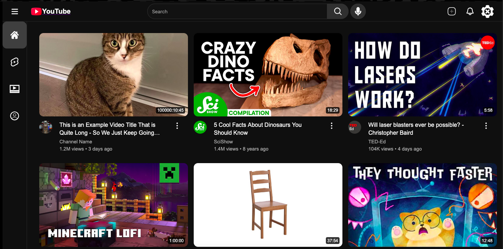

> [!CAUTION]
> **DISCLAIMER**: This project is built for **educational purposes only**.
> It is just a visual imitation of the YouTube homepage and is not affiliated with, endorsed by, or connected to YouTube or Google.

</img>

# YT-clone

This project is a static YouTube clone built to imitate the aesthetic of the YouTube platform. I simply built it to learn more about front end design.

## Features

- Static Youtube clone
- Responsive design

## Technologies Used

- HTML
- CSS

## Installation

If you want to add to the project or make it your own, Clone the repository:
```bash
git clone https://github.com/GlassyBridge/YT-clone.git
```

## Usage

1. Open with live server or click on the `index.html` file
2. Or just head to [this website](https://glassybridge.github.io/YT-clone/).

## License

This project is licensed under the [MIT License](LICENSE).

## Acknowledgments

- YouTube
